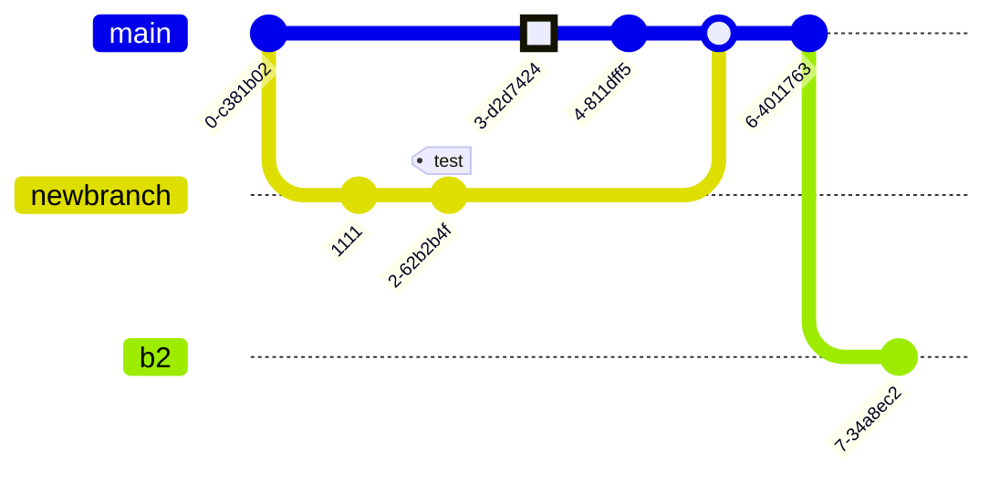

Eos eu docendi tractatos sapientem, brute option menandri in vix, quando vivendo accommodare te ius. Nec melius fastidii constituam id, viderer theophrastus ad sit, hinc semper periculis cum id. Noluisse postulant assentior est in

$$\begin{equation}
\begin{aligned}
a &= b + c \\
  &= d + e + f + g \\
  &= h + i
\end{aligned}
\end{equation}$$

 no choro sadipscing repudiandae vix. Vis in euismod delenit dignissim. Ex quod nostrum sit, suas decore animal id ius, nobis solet detracto quo te.

 


Might you have an include in your theme? Why not try it here!



No laudem altera adolescens has, volumus lucilius eum no. Eam ei nulla audiam efficiantur. Suas affert per no, ei tale nibh sea. Sea ne magna harum, in denique scriptorem sea, cetero alienum tibique ei eos. Labores persequeris referrentur eos ei.

